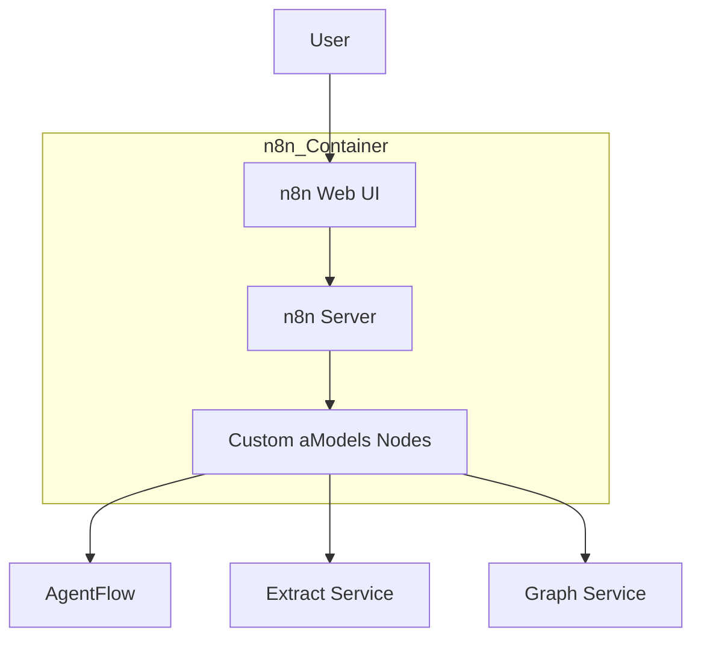

# n8n Service - Comprehensive Documentation

The n8n Service provides a powerful workflow automation platform integrated into the aModels ecosystem, enabling visual workflow design and execution.

## Table of Contents
1. [Service Overview](#service-overview)
2. [Architecture](#architecture)
3. [Components](#components)
4. [Dependencies](#dependencies)
5. [Data Models](#data-models)
6. [Integrations](#integrations)
7. [API Endpoints](#api-endpoints)
8. [Configuration](#configuration)
9. [Deployment](#deployment)
10. [Usage Examples](#usage-examples)

---

## Service Overview

**n8n Service** is a customized deployment of the popular n8n workflow automation tool. It includes:

- **Custom Nodes**: Specific nodes for interacting with aModels services.
- **Branding**: Custom aModels theming.
- **Pre-configured Workflows**: Standard automation patterns.

### Key Features

- **Visual Editor**: Drag-and-drop workflow builder.
- **Extensible**: Support for custom nodes and external triggers.
- **Self-Hosted**: Full control over data and execution.

---

## Architecture

### High-Level Architecture

---

## Components

### 1. n8n Server

The core n8n application, running on Node.js.

### 2. Custom Nodes (`infrastructure/third_party/n8n/packages/@n8n/nodes-amodels`)

A set of custom nodes developed specifically for aModels:
- **AgentFlow Node**: Trigger and interact with AgentFlow.
- **Extract Node**: Submit documents for extraction.
- **Graph Node**: Query the knowledge graph.

### 3. Branding (`services/gateway/frontend/src/styles/n8n-theme-overrides.css`)

Custom CSS to align n8n's appearance with the aModels platform.

---

## Dependencies

### Docker Dependencies (`infrastructure/docker/Dockerfile.n8n`)

- **Base Image**: `n8nio/n8n:latest`
- **Build Dependencies**: `python3`, `make`, `g++` (for building custom nodes)

### External Service Dependencies

- **PostgreSQL**: For n8n's internal database (optional, defaults to SQLite).
- **aModels Services**: For custom node functionality.

---

## Data Models

### Workflow JSON

n8n workflows are stored as JSON objects defining:
- **Nodes**: The steps in the workflow.
- **Connections**: The links between nodes.
- **Settings**: Execution parameters.

---

## Integrations

### 1. AgentFlow
- **Integration**: Custom Node
- **Capabilities**: Run flows, get results.

### 2. Extract Service
- **Integration**: Custom Node / HTTP Request
- **Capabilities**: Document processing.

---

## API Endpoints

n8n exposes a REST API for management.

### Workflow Management

#### `GET /api/v1/workflows`
List workflows.

#### `POST /api/v1/workflows/{id}/execute`
Execute a workflow.

---

## Configuration

### Environment Variables

- `N8N_EDITOR_BASE_URL`: Public URL of the editor.
- `N8N_CUSTOM_EXTENSIONS`: Path to custom nodes.
- `DB_TYPE`: Database type (sqlite, postgresdb).

---

## Deployment

### Docker Build

**Dockerfile**: `infrastructure/docker/Dockerfile.n8n`

**Base Image**: `node:18-alpine` (builder), `n8nio/n8n:latest` (runtime)

**Build Process**:
1. **Builder**: Build custom nodes package.
2. **Runtime**:
   - Copy custom nodes to `~/.n8n/custom`.
   - Inject custom branding.
   - Set permissions.

### GitHub Actions Workflow

**File**: `.github/workflows/publish-n8n.yml`

**Triggers**:
- Push to `main` (paths: `infrastructure/third_party/n8n/**`, etc.)
- Workflow dispatch

---

## Usage Examples

### Custom Node Usage

In the n8n editor, search for "aModels" to find the custom nodes. Drag them onto the canvas and configure them with the necessary service URLs and API keys.
